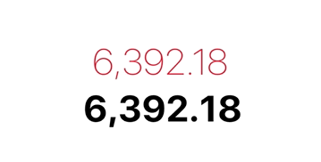

# SMCounterLabel

[](https://travis-ci.org/slavenko/SMCounterLabel)
[](https://cocoapods.org/pods/SMCounterLabel)
[](https://cocoapods.org/pods/SMCounterLabel)
[](https://cocoapods.org/pods/SMCounterLabel)

# Screenshot


## Example

To run the example project, clone the repo, and run `pod install` from the Example directory first.

## Usage
```
//Format type integer/decimal/fancy
label.formatType = .decimal

//How long it takes to animate one character
label.duration = 0.6

//How long to wait before the next character starts animating
label.delay = 0.2

//If for some reason you want the 
//animation to slow down towards the end
label.durationIncrement = 0.0

//Text color obviously
label.color = .darkGray

//Set the label value
label.setValue(1234.56)
```

## Requirements

## Installation

SMCounterLabel is available through [CocoaPods](https://cocoapods.org). To install
it, simply add the following line to your Podfile:

```ruby
pod 'SMCounterLabel'
```

## Author

Slavenko Miljic, slavenko.miljic@gmail.com

## License

SMCounterLabel is available under the MIT license. See the LICENSE file for more info.
